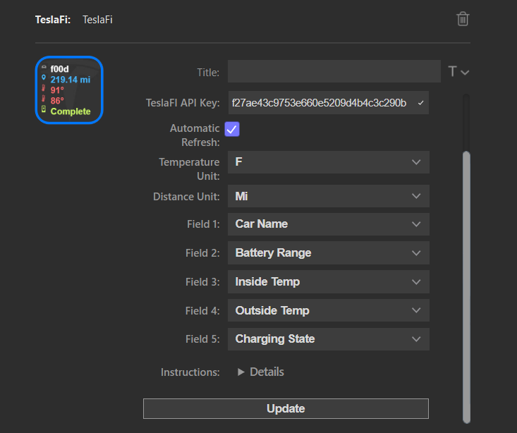

# Tesla Status Plugin for Elgato Streamdeck

View your Tesla Data using TeslaFi API

This an extension for the [ElGato-StreamDeck](https://www.elgato.com/en/gaming/stream-deck).

## Screenshot

Please report any issues you see on the project's Github page. I welcome any feedback.

## Installation

Download from Release folder [Release Folder](Release/com.f00d4tehg0dz.teslafi.streamDeckPlugin)

Double click to install to StreamDeck. 

Make sure you have an active subscription with [TeslaFi](https://teslafi.com) and enable your API key

## Ongoing work

clean up the heck out of the codebase

